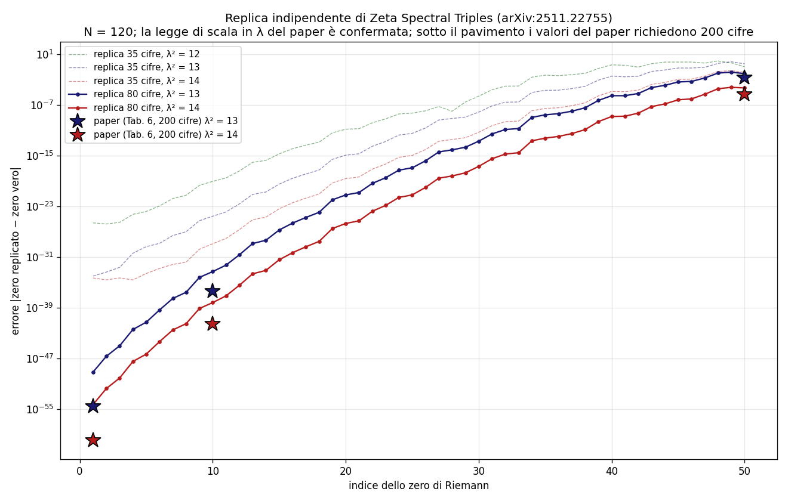

# Independent numerical replication of "Zeta Spectral Triples"

[](https://doi.org/10.5281/zenodo.20629361)

Independent numerical replication of the construction in **"Zeta Spectral
Triples"** by A. Connes, C. Consani and H. Moscovici
([arXiv:2511.22755](https://arxiv.org/abs/2511.22755), November 2025):
self-adjoint operators built from the truncated Weil quadratic form on
`L²([λ⁻¹, λ], d*u)`, whose spectra reproduce the low-lying nontrivial zeros
of the Riemann zeta function — using only the primes `p ≤ λ²`, the digamma
function and the pole term.

This replication shares **no code or data** with the original paper beyond
the three public parameters (`N = 120`, `λ² ∈ {12, 13, 14}`).

## Key results (80 working digits, N = 120)

| zero # | λ²=13 (this work) | λ²=13 (paper) | λ²=14 (this work) | λ²=14 (paper) |
|---|---|---|---|---|
| 1  | 6.4e-50 | 2.4e-55 | **4.8e-55** | 1.1e-60 |
| 10 | 4.9e-34 | 4.0e-37 | 6.2e-39 | 3.0e-42 |
| 30 | 2.0e-13 | – | 2.1e-17 | – |
| 50 | 9.3e-03 | 2.0e-03 | 5.1e-05 | 4.8e-06 |

(Errors are `|replicated zero − Riemann zero|`; "paper" values from Table 6
of arXiv:2511.22755, computed there at 200 digits. Each column saturates its
own numerical floor.)

- **The first Riemann zero is reproduced to 54 correct digits** from a
  121×121 matrix built with nine prime powers.
- The **λ-scaling law** of the errors (3–5 orders of magnitude per step
  λ² = 12→13→14) and their growth with the zero index match the paper.
- The **minimal eigenvalues of the truncated Weil form** — an independent
  data point not reported in the preprint: ε₁ = 8.16e-52 (λ²=13),
  ε₁ = 6.01e-57 (λ²=14). Truncated Weil positivity holds numerically down
  to that scale, and ε₁ decreases with λ.
- **Methodological caveat**: at 35 working digits the bottom four
  eigenvalues are numerically degenerate; the resulting eigenvector mixture
  inflates the errors at zeros #45–50 by ~2 orders of magnitude. 80 digits
  resolve the cluster.



## How to run

Requirements: Python ≥ 3.10, then

```
pip install mpmath numpy scipy matplotlib
```

Suggested order:

1. `python src/replica_zeta_spectral_triples.py` — float64 prototype
   (~1 min): the first six zeros emerge at 1e-3/1e-4 accuracy, plus the
   per-prime decomposition figure;
2. `python src/replica_zst_80.py` — main 80-digit run (~42 min on a
   laptop): error tables for λ² = 13, 14 and the minimal eigenvalues;
3. *(optional)* `python src/replica_zst_hp.py` — 35-digit run, all three
   λ², exhibiting the bottom-cluster degeneracy;
4. `python src/grafico_replica_hp.py` — regenerates the summary figure
   from the JSON results.

Full method and discussion: [replication_note.md](replication_note.md).

## Citation

This replication is permanently archived at
[DOI 10.5281/zenodo.20629361](https://doi.org/10.5281/zenodo.20629361).
Please cite it via the `CITATION.cff` file (GitHub's "Cite this repository"
button) or the Zenodo record, and cite the original paper:

> A. Connes, C. Consani, H. Moscovici, *Zeta Spectral Triples*,
> arXiv:2511.22755 (2025).

## Disclosure

The implementation was carried out with the assistance of AI tooling, under
the author's direction, with independent validation of the numerics (the
Weil explicit-formula identity was cross-checked against a direct sum over
the first 200 zeta zeros before use).

## License

MIT — see [LICENSE](LICENSE).
